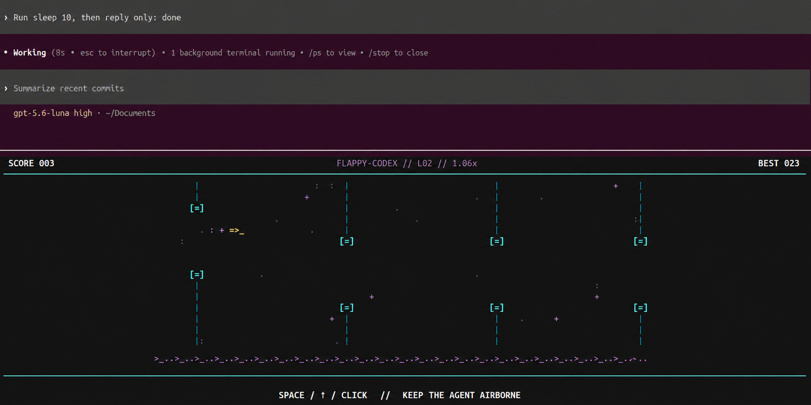

# Flappy Codex

[](https://github.com/SamuelEmery/flappycodex/actions/workflows/ci.yml)
[MIT licensed](LICENSE)

An opt-in terminal game for the moments when the Codex CLI is working. Flappy
Codex wraps an existing Codex installation; it does not contain, patch, compile,
or rebuild Codex.



The game has its own Codex-themed presentation: a flying prompt cursor (`/>_`,
`=>_`, `\>_`), cyan `[=]` execution gates, static code particles, a stable
`>_..` prompt rail, and a midnight synth palette. Decorative elements remain
still to avoid terminal shimmer, while gravity, gate spacing, and speed make the
game deliberately unforgiving. The best score persists between sessions and
the layout scales down for smaller terminals.

> [!IMPORTANT]
> Flappy Codex is an unofficial community project. It is not affiliated with or
> endorsed by OpenAI.

## Requirements

- Linux or macOS
- Python 3.10 or newer
- [tmux](https://github.com/tmux/tmux/wiki/Installing)
- An installed Codex CLI with lifecycle hooks (initially tested with 0.147.0)

Plain `codex` continues to work without tmux. Only `codex --flappy` needs it.

## Install

```bash
git clone https://github.com/SamuelEmery/flappycodex.git
cd flappycodex
./install.sh
```

Open a new terminal, then run:

```bash
codex --flappy
```

Normal Codex arguments are forwarded unchanged:

```bash
codex --flappy --model gpt-5 "inspect this project"
```

The installer adds a small Python launcher earlier on `PATH` and leaves the
original Codex files untouched. Plain `codex` immediately replaces the launcher
process with the next real Codex executable on the current `PATH`, using the
install-time location only as a fallback. Arguments, standard input/output,
signals, prompts, and rendering stay on the original path. Node version managers
and normal Codex upgrades therefore continue to work.

### What the installer changes

With the default XDG locations, the installer creates:

- `~/.local/share/flappycodex/flappycodex.py` — the installed launcher;
- `~/.config/flappycodex/config.json` — the original Codex and shim paths;
- `~/.local/bin/codex` — the launcher placed on `PATH`; and
- `~/.config/flappycodex/best-score.json` — created after a best score is saved.

If `~/.local/bin/codex` is already occupied, the launcher uses its own data
directory instead. The installer adds a clearly marked `PATH` block to
`~/.bashrc` or `~/.zshrc` only when necessary. Other shells receive a path to
add manually. XDG paths and install locations can be overridden with
`XDG_DATA_HOME`, `XDG_CONFIG_HOME`, `FLAPPY_CODEX_HOME`, and
`FLAPPY_CODEX_BIN_DIR`.

Shell configuration updates are written atomically, preserve the file's
permissions, and follow symlink-managed dotfiles without replacing the symlink.
Before changing an existing file for the first time, the installer creates a
sibling backup such as `.bashrc.flappycodex.bak`. A clean uninstall removes that
backup when the restored configuration matches it; if the user has made other
changes, the backup is retained and its location is printed.

## Trust and safety

Flappy Codex intentionally places a launcher named `codex` earlier on `PATH`,
which deserves scrutiny. The addon's complete review surface is the small
[launcher](flappycodex.py), [installer](install.sh), and
[uninstaller](uninstall.sh), all available to inspect before running anything.

- Plain `codex` uses `execv` to replace the launcher with the next real Codex
  executable on `PATH`; it does not proxy the session.
- The addon itself makes no network requests and contains no telemetry or
  third-party runtime dependencies.
- It never reads the Codex pane, prompt text, hook payloads, API keys, or
  standard input intended for Codex.
- Lifecycle hooks and tmux settings exist only for the current `--flappy`
  session. No persistent Codex configuration or global key binding is added.
- Runtime files and the local state socket live in a private, randomly named
  temporary directory that is removed when the session ends.
- Uninstall only deletes a launcher named exactly `codex` after verifying the
  Flappy Codex marker.

Security concerns should be reported privately as described in
[SECURITY.md](SECURITY.md).

## How it works

`--flappy` creates an isolated tmux game pane and runs the original Codex in the
main pane. Temporary, per-session lifecycle hooks tell the game when Codex:

- starts or finishes work;
- requests user input;
- requests permission; or
- ends the session.

Hook configuration is passed only on the `--flappy` command line. The addon does
not edit `~/.codex/config.toml`, and it calculates hook trust hashes instead of
bypassing Codex's hook security.

Click the lower pane (or use normal tmux pane navigation) and press Space to
start. Flap with Space, Up, or a mouse click. Inside an existing tmux session,
click-to-focus follows the existing mouse setting; the addon does not change it.
It never installs a global Space binding and never reads from the Codex pane.
When a supported prompt hook fires, focus returns to Codex before the prompt is
shown. After an answer is accepted, the game displays a three-second countdown.

For permission prompts, Codex exposes a pre-prompt hook and a post-tool hook.
The game remains paused until the approved tool finishes. If permission is
denied or aborted, it remains paused until the next lifecycle event, normally
Codex becoming idle. This favors input safety over guessing from terminal
output.

## Controls

- Space / Up / click: launch, boost, or reboot after a failed run
- R: return to the start screen
- Esc / Q: close only the game pane

## Update

From the cloned repository:

```bash
git pull --ff-only
./install.sh
```

Running the installer again updates the launcher without resetting the best
score.

## Uninstall

```bash
./uninstall.sh
```

This removes the launcher, managed shell `PATH` block, configuration, and saved
score. To keep the score for a future installation:

```bash
./uninstall.sh --keep-score
```

The original Codex installation is never removed.

## Contributing

Bug reports and focused pull requests are welcome. See
[CONTRIBUTING.md](CONTRIBUTING.md) for the development commands and submission
guidelines. Please report security problems using [SECURITY.md](SECURITY.md),
not a public issue.

## License

Flappy Codex is released under the [MIT License](LICENSE).

The original gameplay experiment was inspired by
[ASCII Bird](https://www.asciibird.com/).
